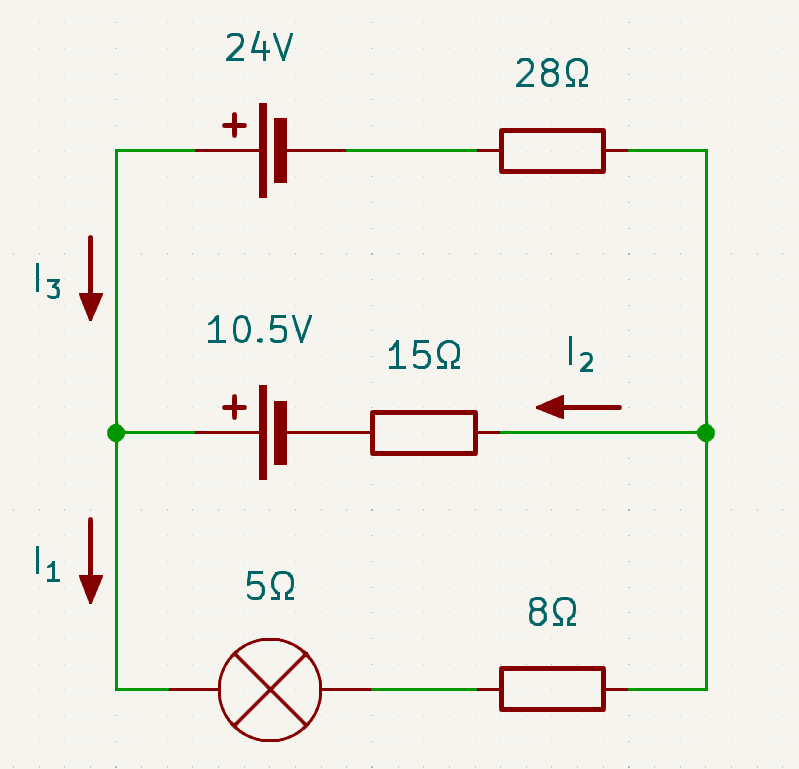
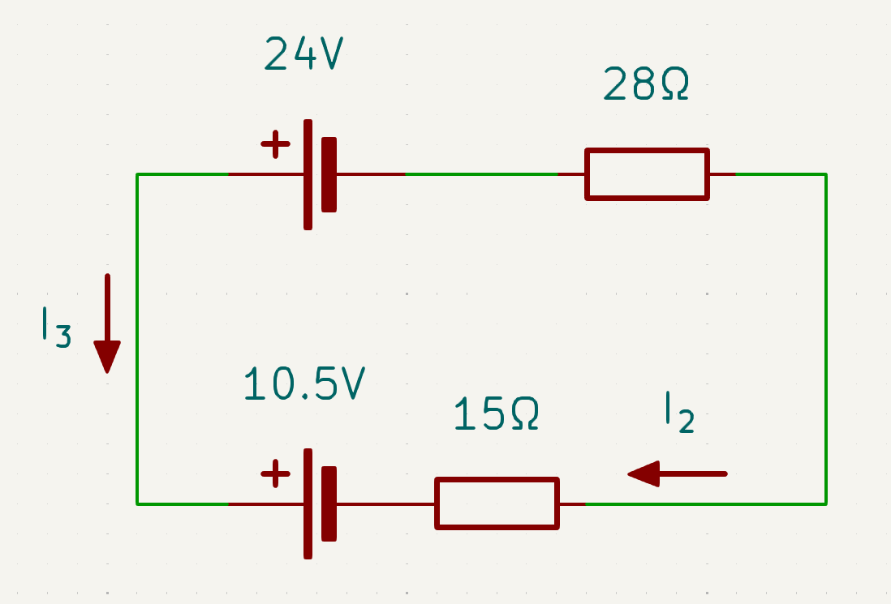
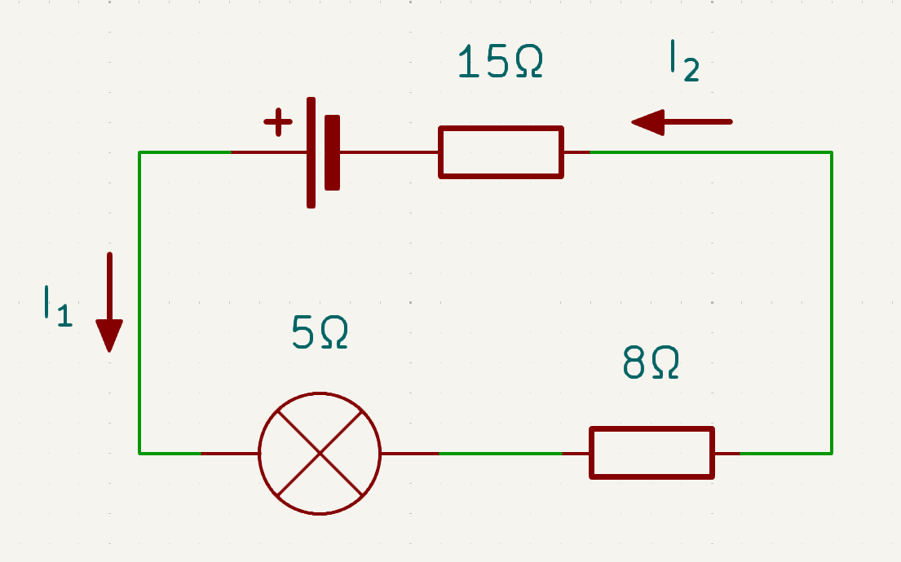

# Electrical Systems Notes

## Direction
### Actual current
Negative $\rightarrow$ Positive

### Conventional current
Positive $\rightarrow$ Negative

## Symbols
|Symbol|Name|Unit|
|-|-|-|
|$A$|Common area of overlap|$m^2$ (Metres squared)|
|$B$|Flux Density|$T$ (Tesla) or $Wb/m^2$ (Weber per square metre)|
|$C$|Capacitance|$F$ (Farads)|
|$d$|Distance|$m$ (Metres)|
|$E$|Energy|$J$ (Joule)|
|$f_o$|Resonant Frequency|Hz (Hertz)|
|$\xi$|EMF (Electromotive force)|$V$ (Volts)|
|$\xi_0$|Absolute Permittivity of free space|$F/m$ (Farad per metre)|
|$\xi_r$|Dielectric constant|Unitless|
|$L$|Inductance|$H$ (Henry)|
|$P$|Power|$W$ (Watt)|
|$R$|Resistance|$\Omega$ (Ohms)|
|$t$ |Time|$s$ (seconds)|
|$\tau$|Time constant|$s$ (Seconds)|
|$Q$/$q$|Electric charge|$C$ (Coulombs)|
|$\omega$|Angular frequency|rad/s (radian per second)|
|$Z$|Impedance||

## Equations
### Capacitors
$C_T =$ Total capactitance
- $C = \frac{\xi_o \xi_r A}{d}$
- $\frac{1}{C_T} = \frac{1}{C_1} + \frac{1}{C_2}...$ (Capacitors in series)
- $C_T = C_1 + C_2 + ...$ (Capacitors in parallel)

### Current
$I_\textbf{rms} = \frac{I_0}{\sqrt{2}}$ (rms = root mean square)

### Energy/Electric field strength
- $E = \frac{1}{2}QV$
- $E = \frac{1}{2}CV^2$
- $E = \frac{V}{d}$
- $\Delta E_p = Vq$

### EMF (Electromotive Force)
- $\xi = -L \frac{\Delta I}{\Delta t}$
- $\xi = - \frac{\Delta \phi}{\Delta t}$

- $Q = CV$

- $\tau = RC$
- $R_t = R_1 + R_2 + ...$ (Resistance total = sum of all resistances)
- $\frac{1}{R_t} = \frac{1}{R_1} + \frac{1}{R_2} + ...$ ($\frac{1}{\textbf{Resistance total}} = \frac{1}{\textbf{Resistance}}$ (for each resistance))

- $P = VI$
- $\phi = BA$

### Voltage
- $V = IR$
- $V = Ed$
- $V = V_\textbf{MAX}sin\omega t$
- $V_\textbf{rms} = \frac{V_0}{\sqrt{2}}$ (rms = root mean square)

### Frequency
- $f_o = \frac{1}{2 \pi \sqrt{LC}}$
- $f = \frac{1}{T}$
- $\omega = 2\pi f$

- $\frac{N_p}{N_s} = \frac{V_p}{V_s}$ ($p$ = primary, $s$ = secondary)

$X_c = \frac{1}{\omega C}$ (Reactance)

for an inductor reactance depends on:
- the ac freq
- the inductance L
$X_L = \omega L$
$X_L = 2 \pi f L$

## Kirchoff's Law
Sum of current at a node must equal 0:

$\sum i = 0$

(Use '+' and '-' to show direction)

$\sum V_{rise} - \sum V_{drop} = 0$

or

$\sum V_{i(loop)} = 0$

(insert example diagrams)

<!-- #region drawnote -->
<svg id="svg" xmlns="http://www.w3.org/2000/svg" viewbox="92.68000030517578,83.12999725341797,409.9413757324219,275.5577697753906" style="height:275.5577697753906"><line x1="158.24" y1="93.13" x2="157.55" y2="318.48" fill="none" stroke="#6190e8" stroke-width="2" d="M 158.24 93.13 L 157.55 318.48"></line><line x1="157.54" y1="318.83" x2="452.69" y2="323.34" fill="none" stroke="#6190e8" stroke-width="2" d="M 157.54 318.83 L 452.69 323.34"></line><line x1="158.93" y1="316.74" x2="182.55" y2="293.48" fill="none" stroke="#6190e8" stroke-width="2" d="M 158.93 316.74 L 182.55 293.48"></line><line x1="195.04" y1="280.63" x2="220.04" y2="263.27" fill="none" stroke="#6190e8" stroke-width="2" d="M 195.04 280.63 L 220.04 263.27"></line><line x1="241.57" y1="247.99" x2="270.05" y2="224.03" fill="none" stroke="#6190e8" stroke-width="2" d="M 241.57 247.99 L 270.05 224.03"></line><line x1="295.04" y1="198.69" x2="325.61" y2="172.65" fill="none" stroke="#6190e8" stroke-width="2" d="M 295.04 198.69 L 325.61 172.65"></line><line x1="342.26" y1="153.55" x2="373.52" y2="129.59" fill="none" stroke="#6190e8" stroke-width="2" d="M 342.26 153.55 L 373.52 129.59"></line><line x1="326.29" y1="129.94" x2="372.83" y2="128.9" fill="none" stroke="#6190e8" stroke-width="2" d="M 326.29 129.94 L 372.83 128.9"></line><line x1="372.82" y1="129.24" x2="371.44" y2="183.06" fill="none" stroke="#6190e8" stroke-width="2" d="M 372.82 129.24 L 371.44 183.06"></line><text font-family="inherit" font-size="14" fill="#6190e8" x="308.24" y="345.91">V_c</text><text font-family="inherit" font-size="14" fill="#6190e8" x="102.68" y="130.63">V_r</text><text font-family="inherit" font-size="14" fill="#6190e8" x="477.68" y="152.16">Vs</text></svg>  
<!-- #endregion -->
<!-- #region drawnote -->
<svg id="svg" xmlns="http://www.w3.org/2000/svg" viewbox="70.45999908447266,47.380001068115234,370.0100402832031,321.38775634765625" style="height:321.38775634765625"><line x1="142.96" y1="58.77" x2="143.66" y2="322.65" fill="none" stroke="#6190e8" stroke-width="2" d="M 142.96 58.77 L 143.66 322.65"></line><line x1="143.65" y1="322.66" x2="421.44" y2="326.12" fill="none" stroke="#6190e8" stroke-width="2" d="M 143.65 322.66 L 421.44 326.12"></line><line x1="147.12" y1="318.49" x2="172.14" y2="296.26" fill="none" stroke="#6190e8" stroke-width="2" d="M 147.12 318.49 L 172.14 296.26"></line><line x1="195.04" y1="279.6" x2="224.91" y2="255.28" fill="none" stroke="#6190e8" stroke-width="2" d="M 195.04 279.6 L 224.91 255.28"></line><line x1="256.15" y1="234.46" x2="288.11" y2="208.76" fill="none" stroke="#6190e8" stroke-width="2" d="M 256.15 234.46 L 288.11 208.76"></line><line x1="322.82" y1="176.13" x2="356.16" y2="148.34" fill="none" stroke="#6190e8" stroke-width="2" d="M 322.82 176.13 L 356.16 148.34"></line><line x1="399.9" y1="115.02" x2="429.08" y2="92.09" fill="none" stroke="#6190e8" stroke-width="2" d="M 399.9 115.02 L 429.08 92.09"></line><line x1="429.07" y1="92.1" x2="388.8" y2="97.65" fill="none" stroke="#6190e8" stroke-width="2" d="M 429.07 92.1 L 388.8 97.65"></line><line x1="429.76" y1="90.71" x2="430.47" y2="128.9" fill="none" stroke="#6190e8" stroke-width="2" d="M 429.76 90.71 L 430.47 128.9"></line><text font-family="inherit" font-size="14" fill="#6190e8" x="80.46" y="129.6">R</text><text font-family="inherit" font-size="14" fill="#6190e8" x="275.6" y="355.99">X_c</text><text font-family="inherit" font-size="14" fill="#6190e8" x="381.85" y="160.16">Z</text><path d="M 204.07,274.05 L 205.47,275.42 L 206.86,276.12 L 226.29,305.99 L 226.29,305.3 L 226.29,305.3 L 230.46,303.21 L 235.32,301.13 L 240.18,299.05 L 240.87,299.05 L 241.57,299.05 L 240.87,299.05 L 240.18,299.05 L 237.4,299.74 L 236.71,299.74" fill="none" stroke="#6190e8" stroke-width="2"></path><line x1="141.57" y1="59.46" x2="129.08" y2="83.06" fill="none" stroke="#6190e8" stroke-width="2" d="M 141.57 59.46 L 129.08 83.06"></line><line x1="147.12" y1="57.38" x2="164.5" y2="96.26" fill="none" stroke="#6190e8" stroke-width="2" d="M 147.12 57.38 L 164.5 96.26"></line><line x1="420.04" y1="321.96" x2="392.27" y2="299.03" fill="none" stroke="#6190e8" stroke-width="2" d="M 420.04 321.96 L 392.27 299.03"></line><path d="M 236.71,299.74" fill="none" stroke="#6190e8" stroke-width="2"></path><path d="M 222.12,265.71" fill="none" stroke="#6190e8" stroke-width="2"></path><path d="M 220.74,264.32 L 221.44,265.01 L 222.83,266.4 L 222.83,267.09 L 224.91,268.48 L 226.3,269.87 L 229.08,272.65 L 231.86,274.73 L 231.86,275.42 L 233.94,277.51 L 233.94,277.51 L 235.33,279.59 L 236.72,280.98 L 238.11,282.37 L 239.5,283.76 L 240.19,285.84 L 241.58,287.23 L 241.58,288.62 L 242.27,290.7 L 242.97,291.4 L 243.66,292.78 L 244.36,293.48 L 244.36,294.87 L 245.05,296.26 L 245.75,297.65 L 246.44,298.34 L 246.44,299.73 L 246.44,300.42 L 247.14,301.81 L 247.14,302.51 L 247.83,303.9 L 247.83,304.59 L 248.52,305.98 L 248.52,306.67 L 248.52,307.37 L 249.22,309.45 L 249.22,310.15 L 249.22,310.84 L 249.22,311.53 L 249.22,312.23 L 249.22,312.92 L 249.22,313.62 L 249.22,314.31 L 249.22,314.31 L 249.91,315.7 L 249.91,316.4 L 249.91,316.4 L 249.91,317.09 L 249.91,317.78 L 249.91,318.48 L 249.91,319.17 L 249.91,319.87 L 249.91,319.87" fill="none" stroke="#6190e8" stroke-width="2"></path><text font-family="inherit" font-size="14" fill="#6190e8" x="263.1" y="276.82">thta</text><path d="M 212.4,261.55 L 211.02,260.15 L 208.94,258.76 L 204.08,253.2 L 194.36,243.48 L 192.27,240.7 L 186.02,235.84 L 183.94,234.45 L 181.16,233.06 L 180.47,232.37 L 177,230.28 L 176.3,230.28 L 174.91,229.59 L 173.52,229.59 L 172.14,228.9 L 170.75,228.2 L 170.05,228.2 L 169.36,228.2 L 167.27,227.51 L 166.58,227.51 L 165.89,227.51 L 163.8,226.81 L 163.11,226.81 L 162.41,226.81 L 161.02,226.81 L 160.33,226.81 L 159.64,226.81 L 158.94,226.81 L 158.25,226.81 L 156.86,226.81 L 156.16,226.81 L 155.47,226.81 L 153.39,226.81 L 153.39,226.81 L 152.69,226.81 L 152.69,226.81 L 152,226.81" fill="none" stroke="#6190e8" stroke-width="2"></path><line x1="186.71" y1="212.24" x2="213.79" y2="130.3" fill="none" stroke="#6190e8" stroke-width="2"></line><line x1="213.79" y1="130.3" x2="213.79" y2="130.3" fill="none" stroke="#6190e8" stroke-width="2" d="M 213.79 130.3 L 213.79 130.3"></line><text font-family="inherit" font-size="14" fill="#6190e8" x="201.99" y="97.66">90-theta</text></svg>  
<!-- #endregion -->

## Multiloop circuits
|||
|-|-|
| ||
|||
|||

capacitors store energy by creating a charge difference between 2 sheets of metal

capactitance 

$C = \frac{Q}{V}$

Q = mag of charge

voltage dif is created bwtween sheets

farads

capactitance = physical chars of capacitor

C = mF
= 10^6 F

must convert mF to F

$E_p = \frac{1}{2} QV$

$C = Q/V$

capacitors are only 1/2 because the voltage difference decreases as energy is used

$E = 1/2 C V^2$

have to use specific voltage in capacitor equations

## Right hand grip rule

- like arrow + is towards paper, . is away from paper
- thumb in dir of wire/current/north
- fingers in dir of field

## fields

- if 2 fields in same dir they join, if in separate directions they are separate

## Right hand slap rule
- thumb in dir of current
- fingers in dir of mag field
- palm in dir of lorentz force

$F=BIL$

transformer works by stepping up voltrms = root mean squareage, this is useful because higher voltage over long distance is useful

## Things to research
- R in DC
- C in DC
- L in DC
- AC

- Capactivantce 
- Series/parrallel
- Energy 
- Time constant
- Transient voltage

## Phase

- read further on page 228
- read more into phase diff

## LRC Circuits
$V_s = \sqrt{(V_L - V_C)^2 + V_R^2}$

$Z = \sqrt{R^2 + X_L^2}$

$V_s^2 = V_L^2 + V_R^2$

<!-- #region drawnote -->
<svg id="svg" xmlns="http://www.w3.org/2000/svg" viewbox="62.80999755859375,56,411,300" style="height:300"><line x1="179.81" y1="96" x2="179.81" y2="96" fill="none" stroke="#6190e8" stroke-width="2" d="M 179.81 96 L 179.81 96"></line><line x1="160.81" y1="66" x2="160.81" y2="311" fill="none" stroke="#6190e8" stroke-width="2" d="M 160.81 66 L 160.81 311"></line><line x1="160.81" y1="311" x2="463.81" y2="314" fill="none" stroke="#6190e8" stroke-width="2" d="M 160.81 311 L 463.81 314"></line><line x1="163.81" y1="309" x2="384.81" y2="122" fill="none" stroke="#6190e8" stroke-width="2" d="M 163.81 309 L 384.81 122"></line><line x1="384.81" y1="122" x2="384.81" y2="122" fill="none" stroke="#6190e8" stroke-width="2" d="M 384.81 122 L 384.81 122"></line><line x1="384.81" y1="122" x2="351.81" y2="121" fill="none" stroke="#6190e8" stroke-width="2" d="M 384.81 122 L 351.81 121"></line><line x1="385.81" y1="122" x2="386.81" y2="157" fill="none" stroke="#6190e8" stroke-width="2" d="M 385.81 122 L 386.81 157"></line><line x1="158.81" y1="73" x2="150.81" y2="97" fill="none" stroke="#6190e8" stroke-width="2" d="M 158.81 73 L 150.81 97"></line><line x1="161.81" y1="70" x2="176.81" y2="98" fill="none" stroke="#6190e8" stroke-width="2" d="M 161.81 70 L 176.81 98"></line><line x1="463.81" y1="312" x2="440.81" y2="296" fill="none" stroke="#6190e8" stroke-width="2" d="M 463.81 312 L 440.81 296"></line><line x1="462.81" y1="317" x2="430.81" y2="331" fill="none" stroke="#6190e8" stroke-width="2" d="M 462.81 317 L 430.81 331"></line><text font-family="inherit" font-size="14" fill="#6190e8" x="72.81" y="145">X_c</text><text font-family="inherit" font-size="14" fill="#6190e8" x="332.81" y="215">Z</text><text font-family="inherit" font-size="14" fill="#6190e8" x="399.81" y="343">R</text></svg>  
<!-- #endregion -->
*($X_L - X_c$)
<!-- #region drawnote -->
<svg id="svg" xmlns="http://www.w3.org/2000/svg" viewbox="132.80999755859375,52,289,309" style="height:309"><line x1="195.81" y1="63" x2="196.81" y2="351" fill="none" stroke="#6190e8" stroke-width="2" d="M 195.81 63 L 196.81 351"></line><line x1="197.81" y1="211" x2="408.81" y2="214" fill="none" stroke="#6190e8" stroke-width="2" d="M 197.81 211 L 408.81 214"></line><line x1="196.81" y1="62" x2="182.81" y2="89" fill="none" stroke="#6190e8" stroke-width="2" d="M 196.81 62 L 182.81 89"></line><line x1="195.81" y1="64" x2="207.81" y2="91" fill="none" stroke="#6190e8" stroke-width="2" d="M 195.81 64 L 207.81 91"></line><line x1="198.81" y1="347" x2="180.81" y2="322" fill="none" stroke="#6190e8" stroke-width="2" d="M 198.81 347 L 180.81 322"></line><line x1="199.81" y1="348" x2="219.81" y2="318" fill="none" stroke="#6190e8" stroke-width="2" d="M 199.81 348 L 219.81 318"></line><line x1="408.81" y1="213" x2="384.81" y2="198" fill="none" stroke="#6190e8" stroke-width="2" d="M 408.81 213 L 384.81 198"></line><line x1="411.81" y1="216" x2="393.81" y2="228" fill="none" stroke="#6190e8" stroke-width="2" d="M 411.81 216 L 393.81 228"></line><text font-family="inherit" font-size="14" fill="#6190e8" x="277.81" y="252">V_R</text><text font-family="inherit" font-size="14" fill="#6190e8" x="143.81" y="93">V_L</text><text font-family="inherit" font-size="14" fill="#6190e8" x="142.81" y="327">V_C</text></svg>  
<!-- #endregion -->

$X_L = \omega L$ is given in Resource booklet
$Z = \sqrt{R^2 + X_L^2}$ is not given
Phasor diagram $V_L$ leads $V_R$ (need to remember)

## LRC
lrc for tuning

LRC = L > R > C

phasor is shadow vector of oscialltion vector

resonance is when v_l = v_cz

z = impedince